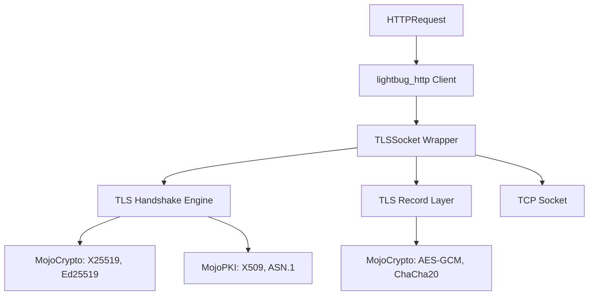

# HTTPS GET Enablement Spec (Mojo-Native TLS Plan)

## Roadmap for `MojoTLS` (Native Implementation)

### Phase 1: Cryptographic Foundation
- **Hashing**: SHA-256 and SHA-384. Leverage Mojo's `hashlib` if possible, or implement directly in Mojo.
- **MAC**: HMAC-SHA256 for integrity checks.
- **Key Derivation**: HKDF (HMAC-based Extract-and-Expand Key Derivation Function) as specified in RFC 5869, required for TLS 1.3 key scheduling.

### Phase 2: Symmetric Cryptography (Record Layer)
- **AEAD**: Implement AES-GCM (Galois/Counter Mode) or ChaCha20-Poly1305.

### Phase 3: Asymmetric Cryptography (Handshake)
- **Key Exchange**: Curve25519 (X25519) for ECDHE. This is the most modern choice for TLS 1.3.
- **Signatures**: Ed25519 or ECDSA (NIST P-256) for verifying server certificates.
- **BigInt Library**: Implement a minimal BigInt math library in Mojo for the necessary elliptic curve operations.

### Phase 4: TLS 1.3 Protocol Logic
- **Handshake State Machine**:
    1. Send `ClientHello` (KeyShare, SupportedGroups, SignatureAlgorithms).
    2. Receive `ServerHello`, `EncryptedExtensions`, `Certificate`, `CertificateVerify`, `Finished`.
    3. Verify Certificate and Signature.
    4. Send `Finished`.
- **Record Protocol**: Fragmenting, compressing (optional), and encrypting/decrypting application data records.

### Phase 5: Certificate & PKI
- **ASN.1 Decoder**: Necessary for parsing X.509 certificates.
- **X.509 Parser**: Extracting Public Keys and Extensions from DER-encoded certificates.
- **Trust Store**: Mechanism to load system CA certificates for validation.

### Phase 6: `lightbug_http` Integration
- Create a `TLSSocket` wrapper that conforms to the interface expected by `lightbug_http.client.Client`.
- Implement a `connect_https` method that performs the handshake before handing the encrypted stream to the HTTP logic.

## Technical Architecture

